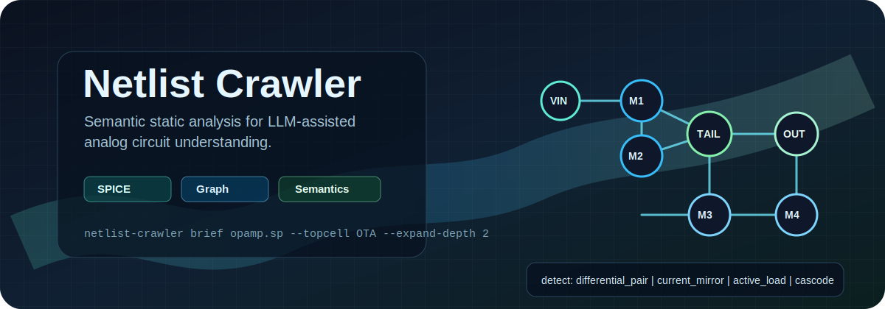

<p align="center">
  
</p>

<p align="center">
  <a href="https://github.com/Arcadia-1/netlist-crawler/actions/workflows/test.yml"></a>
  
  
  
  
  
</p>

<p align="center">
  <strong>Netlist Crawler turns SPICE/Spectre-style netlists into queryable graph evidence, analog semantic labels, and compact LLM-readable briefs.</strong>
</p>

<p align="center">
  <a href="#cli-usage">CLI</a> ·
  <a href="#project-scope">Scope</a> ·
  <a href="#development">Development</a> ·
  <a href="#roadmap">Roadmap</a>
</p>

Netlist Crawler is the infrastructure layer for tool-assisted analog circuit
understanding. It gives agents stable commands for topology queries, hierarchy
summaries, semantic pattern detection, and JSON/text outputs instead of asking
an LLM to reimplement graph algorithms on demand.

At a glance:

| Capability | Commands |
|---|---|
| LLM-readable circuit context | `brief`, `annotate` |
| Persistent workflow IR | `export-ir`, `validate-ir`, `annotation-coverage`, `check-annotations` |
| Structural discovery | `list-subckts`, `summarize` |
| Graph queries | `neighborhood`, `path`, `export-graph` |
| Analog semantics | `detect`, `explain`, `explain-net`, `classify-path` |
| Evaluation hooks | `benchmark` |
| Post-layout parasitic analysis | `scan`, `prescribe`, `inject` |

This repository starts from the existing `analog-netlist-crawl` implementation:
validated post-layout netlist adapters, a canonical circuit IR, sparse
resistance/capacitance kernels, report generation, and R/Cc prescription tools.
The broader repo direction is to extend that foundation toward agent-facing
analog circuit understanding.

## Project Scope

Netlist Crawler focuses on the infrastructure layer:

- Parse practical SPICE/Spectre netlists.
- Build device-net and hierarchy graphs.
- Query neighborhoods, connectivity paths, fanin/fanout-style relationships,
  and subcircuit summaries.
- Detect analog semantic patterns such as differential pairs, current mirrors,
  cascodes, active loads, and tail current sources.
- Separate likely signal, bias, and feedback paths when evidence is available.
- Export agent-friendly JSON and compact human-readable briefs.

Downstream agent workflows, demos, and evaluations can build on this CLI as a
separate project.

## CLI Usage

```bash
netlist-crawler annotate examples/simple_diff_pair.sp --format json
netlist-crawler brief examples/hierarchical_ota.sp --topcell ota_top --expand-depth 1
netlist-crawler benchmark benchmarks/seed_tasks.json
netlist-crawler export-ir examples/simple_diff_pair.sp -o design.nlc.json
netlist-crawler list-subckts examples/hierarchical_ota.sp --format json
netlist-crawler list-subckts examples/include_top.sp --format json
netlist-crawler summarize examples/simple_diff_pair.sp
netlist-crawler summarize examples/param_subckt.sp --topcell param_amp --format json
netlist-crawler summarize examples/two_subckts.sp --topcell bias_block --format json
netlist-crawler summarize examples/include_top.sp --topcell include_top --expand-depth 1 --format json
netlist-crawler summarize examples/hierarchical_ota.sp --topcell ota_top --expand-depth 1 --format json
netlist-crawler neighborhood examples/simple_diff_pair.sp --net voutp --depth 2
netlist-crawler neighborhood examples/rail_bridge.sp --topcell rail_bridge --net a --depth 3 --max-degree 1
netlist-crawler path examples/simple_diff_pair.sp --from vinp --to voutp
netlist-crawler path examples/rail_bridge.sp --topcell rail_bridge --from a --to b --exclude-common-nets
netlist-crawler detect examples/simple_diff_pair.sp --pattern diff-pair
netlist-crawler detect examples/cascode_stage.sp --topcell cascode_stage --pattern cascode
netlist-crawler explain examples/simple_diff_pair.sp --device M1
netlist-crawler explain-net examples/simple_diff_pair.sp --net vbias --format json
netlist-crawler classify-path examples/simple_diff_pair.sp --from vinp --to voutp --format json
netlist-crawler export-graph examples/hierarchical_ota.sp --topcell ota_top --expand-depth 1 --format json
```

`annotate` labels devices and nets with semantic roles. `brief` emits a compact
LLM-readable summary with topology counts, high-degree nets, and
semantic-pattern evidence. `summarize`, `neighborhood`, `path`,
`classify-path`, and `export-graph` operate on a lightweight SPICE-like
structural parser, support `--topcell` for subcircuit selection, and support
relative `.include` files plus `--expand-depth` for hierarchical instance
expansion, including simple named-port X instances. It preserves `.param`
values and `.subckt` default parameters as metadata. All structural commands
support `--format json` for agent use. Path and neighborhood traversal can
exclude common rails or explicit project nets with `--exclude-common-nets` and
`--exclude-net`; `--max-degree` keeps very high-degree nets visible without
letting them dominate traversal. The semantic detector, device explanation,
net explanation, and path classification commands include first-pass rules for
differential pairs, current mirrors, tail current sources, active loads,
cascodes, signal/bias/supply path evidence, and confidence fields in JSON
output. `export-graph` emits a stable bipartite device-net graph in JSON or
GraphML for downstream agent workflows and visualization.

`benchmark` runs JSON task files that assert expected structural and semantic
behavior. The seed task file is intentionally small; it is the starting point
for a larger tool-assisted analog-understanding evaluation set.

## Persistent IR and Annotations

Workflow programs should use `netlist-crawler.ir.v1` as the shared persistent
format. The IR keeps parsed instances, nets, edges, raw source lines,
directives, parameters, subcircuit metadata, and annotations in one JSON
document. The fact layer is separate from semantic overlays: Crawler rule
outputs are stored as candidate annotations with explicit source, confidence,
and evidence, and downstream workflow agents can append their own annotations
without mutating the original netlist facts.

Typical loop:

```bash
netlist-crawler export-ir examples/simple_diff_pair.sp -o design.nlc.json
```

Then workflow code can append annotations and call `validate-ir`,
`annotation-coverage`, and `check-annotations`. A node is considered handled
when it has a semantic label or an explicit disposition such as
`internal`, `unclassified_internal`, `parasitic_only`, or
`unknown_needs_review`. This lets agents avoid renaming nets directly while the
checker verifies coverage, references, conflicts, and basic graph consistency.

The post-layout parasitic analysis engine is also available through:

```bash
netlist-crawler scan examples/parasitics/f1_rc_ladder.flat.scs
netlist-crawler prescribe examples/parasitics/f2_diffpair_cc.flat.scs --nets nIP,nOP -o rc_model.json
netlist-crawler inject --help
```

## Roadmap

1. Harden semantic detectors beyond the first-pass rules: bias trees, feedback
   paths, and project-specific exceptions.
2. Expand the benchmark into LLM-only, raw-netlist, graph-tool, and
   semantic-tool comparisons.
3. Expand Spectre/SPICE syntax coverage around library sections and
   project-specific net aliases.

## Development

```bash
python -m venv .venv
source .venv/bin/activate
pip install -e '.[test]'
python -m pytest -q
```

The pytest suite includes structural CLI tests and the parasitic fixture matrix
ported from `analog-netlist-crawl`.

Python API:

```python
from pathlib import Path
import netlist_crawler as nc

circuit = nc.parse_structural_netlist(Path("examples/simple_diff_pair.sp"))
print(circuit.summary())
print(nc.detect_semantics(circuit, "diff-pair"))
print(nc.explain_net(circuit, "vbias"))
print(nc.classify_path(circuit, "vinp", "voutp"))
```

## Relationship to Workflow Repositories

Netlist Crawler is the infrastructure layer. Agent prompts, multi-step circuit
review flows, UI demos, and benchmark harnesses can live in a separate workflow
repository, for example `analog-agent-workflows`, and depend on this CLI.

The public `L-Trump/analog-design-cli` repository covers related structural
query ideas. This repository does not vendor that code in the initial import;
it keeps Netlist Crawler centered on the earlier proposal and the existing
post-layout analysis implementation.

## Origin

Netlist Crawler builds on an earlier proposal by Token Zhang on AI-assisted
analog circuit understanding. Follow-up technical discussions with collaborators
may refine specific modules such as graph-based netlist analysis, query
interfaces, agent workflows, and evaluation tasks.

## Maintainers

- Token Zhang - project lead and original proposer

## License

MIT
